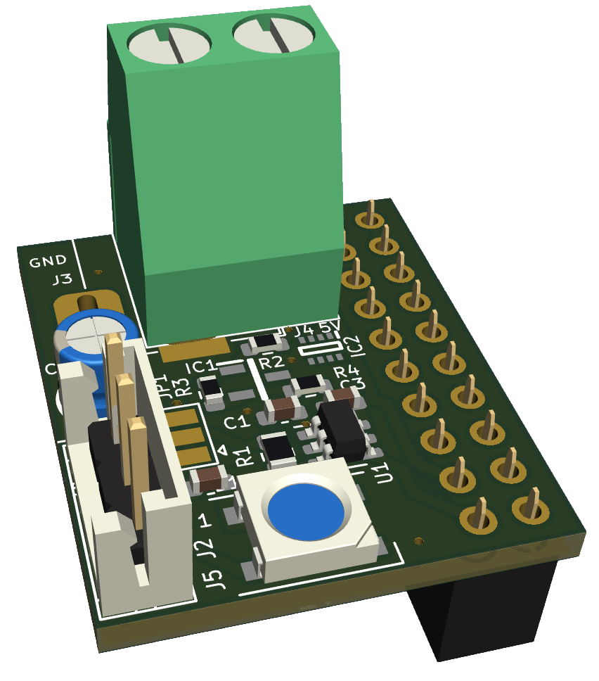

# R-Pi-Digital-LED-Shield

Created with KiCad
 
## Current status: Designed 
 
## Features
- Power R-Pi through DC Jack or screw terminal (over and reverse voltage Protection)
- Onboard Digital LED
	- can be skipped by bridging the solderpoints at JP1
- Level Shifter from 3.3V to 5V

## The Hardware:

## Contributions

Feel free to open Pull Requests here
